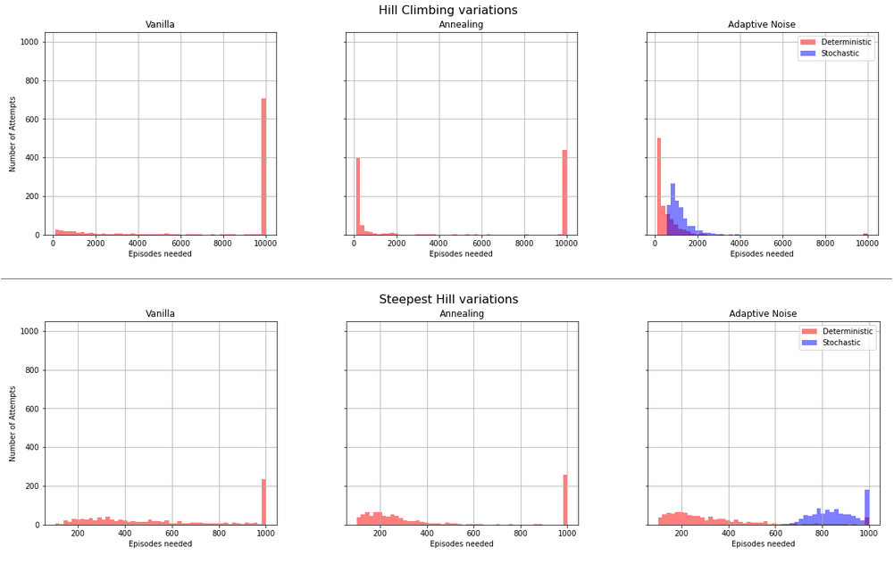

[//]: # (Image References)

[image1]: https://user-images.githubusercontent.com/10624937/42135619-d90f2f28-7d12-11e8-8823-82b970a54d7e.gif "Trained Agent"

# Hill-Climbing Algorithms Comparison for Open AI 'Cartpole-v0' environment

### Introduction

This comparison tries to show some differences of different Agents with Hill Climbing algorithms and their performance in "Cartpole-v0" Environment.

#### The Results

The best algorithm modification (out of the ones considered for this particular Environment) was **Hill Climbing with Adaptive Noise**:
- It took the least amount of time;
- It Achieved the best accuracy;
- It was the most stable.

'* - More details in [report.ipynb](report.ipynb) and [comparison.xlsx](comparison.xlsx)

#### The Environment

    """
    Description:
        A pole is attached by an un-actuated joint to a cart, which moves along
        a frictionless track. The pendulum starts upright, and the goal is to
        prevent it from falling over by increasing and reducing the cart's
        velocity.
    Source:
        This environment corresponds to the version of the cart-pole problem
        described by Barto, Sutton, and Anderson
    Observation:
        Type: Box(4)
        Num     Observation               Min                     Max
        0       Cart Position             -4.8                    4.8
        1       Cart Velocity             -Inf                    Inf
        2       Pole Angle                -0.418 rad (-24 deg)    0.418 rad (24 deg)
        3       Pole Angular Velocity     -Inf                    Inf
    Actions:
        Type: Discrete(2)
        Num   Action
        0     Push cart to the left
        1     Push cart to the right
        Note: The amount the velocity that is reduced or increased is not
        fixed; it depends on the angle the pole is pointing. This is because
        the center of gravity of the pole increases the amount of energy needed
        to move the cart underneath it
    Reward:
        Reward is 1 for every step taken, including the termination step
    Starting State:
        All observations are assigned a uniform random value in [-0.05..0.05]
    Episode Termination:
        Pole Angle is more than 12 degrees.
        Cart Position is more than 2.4 (center of the cart reaches the edge of
        the display).
        Episode length is greater than 200.
        Solved Requirements:
        Considered solved when the average return is greater than or equal to
        195.0 over 100 consecutive trials.
    """

### Replicate the Rusults
#### Step 1: Clone the DRLND Repository

Follow the [instructions in the DRLND GitHub repository](https://github.com/udacity/deep-reinforcement-learning#dependencies) to set up your Python environment. These instructions can be found in README.md at the root of the repository. By following these instructions, you will install PyTorch, the ML-Agents toolkit, and a few more Python packages required to complete the project.

(For Windows users) The ML-Agents toolkit supports Windows 10. While it might be possible to run the ML-Agents toolkit using other versions of Windows, it has not been tested on other versions. Furthermore, the ML-Agents toolkit has not been tested on a Windows VM such as Bootcamp or Parallels.

#### Step 2: Run Notebooks

Change the Agents policy to stochastic or deterministic by commenting out option 1 or option 2 lines in "2. Define the Policy" cell.

Notebooks - (orientational time to do 1000 runs with deterministic policy) :
1. `Hill_Climbing-Vanilla.ipynb` - (90 min)
2. `Hill_Climbing-Vanilla-with Annealing.ipynb` - (100 min)
3. `Hill_Climbing-Vanilla-with Adaptive Noise.ipynb` - (18 min)
4. `Hill_Climbing-Steepest_Hill.ipynb` - (240 min)
5. `Hill_Climbing-Steepest_Hill-with_Annealing.ipynb` - (200 min)
6. `Hill_Climbing-Steepest_Hill-with_Adaptive_noise.ipynb` - (180 min)

### Further Modifications

1. Compare results by changing `max_t` parameter (adjusting it by learning progress might improve comparison efficiency):
    - the Steepest Hill with Adaptive Noise algorithm trains very closely to 1000 steps mark (increase suggested);
    - some algorithms never learn after 100 steps (especially in stochastic Policy case);
2. Compare results by changing `noise_scale` parameter:
    - some algorithms are more sensitive to this parameter than others;
3. Compare results by changing `noise_decay` parameter:
    - algorithms that have this parameter may train faster;
    - algorithms that have this parameter may learn more or less robust Policy (especially Adaptive Noise);
4. Compare results by changing `n_cand` parameter:
    - the Steepest Hill algorithms may perform better or worse with less or more candidates;
    - `n_cand` vs. `n_episodes` how this dynamic changes results;
